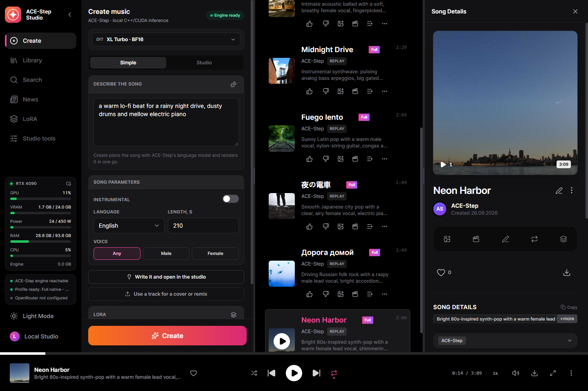
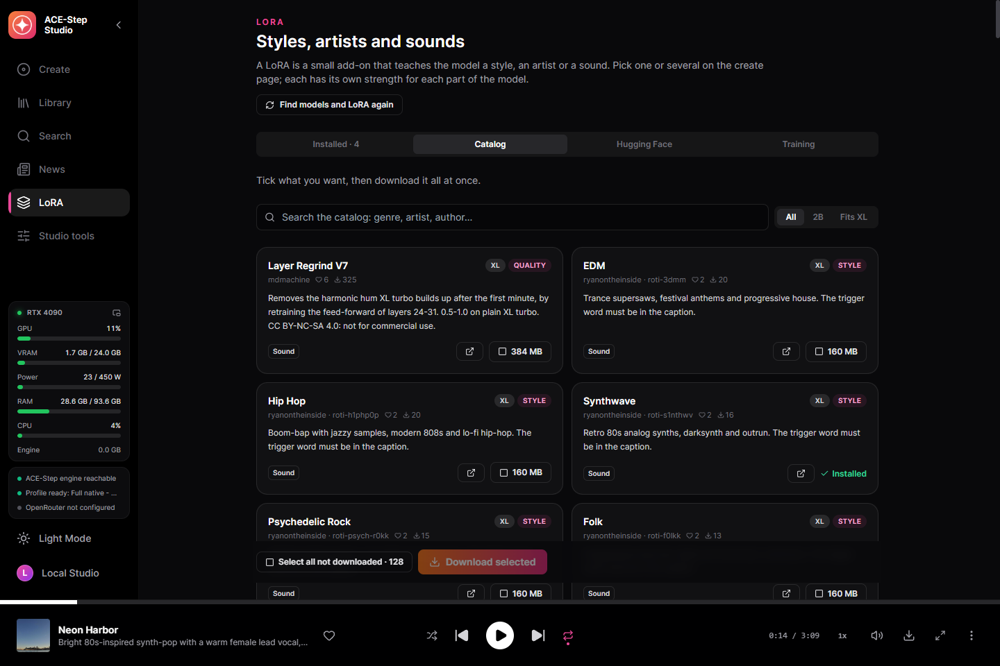
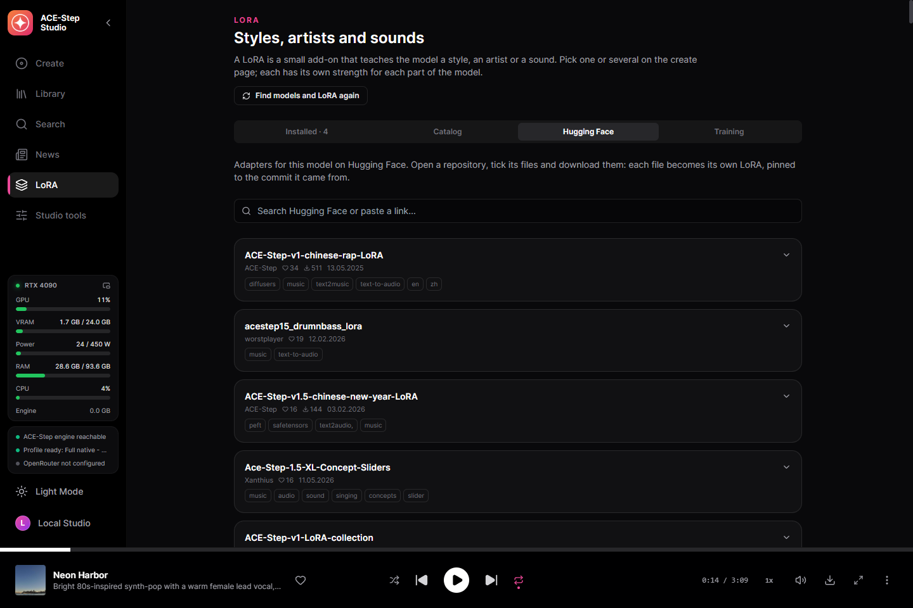
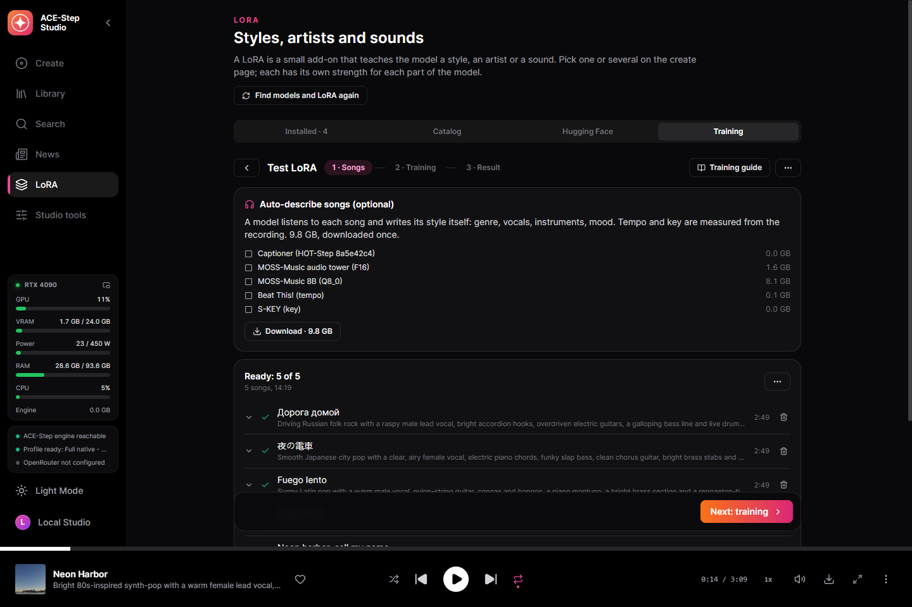
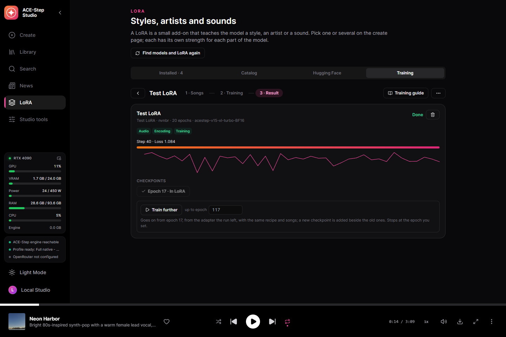
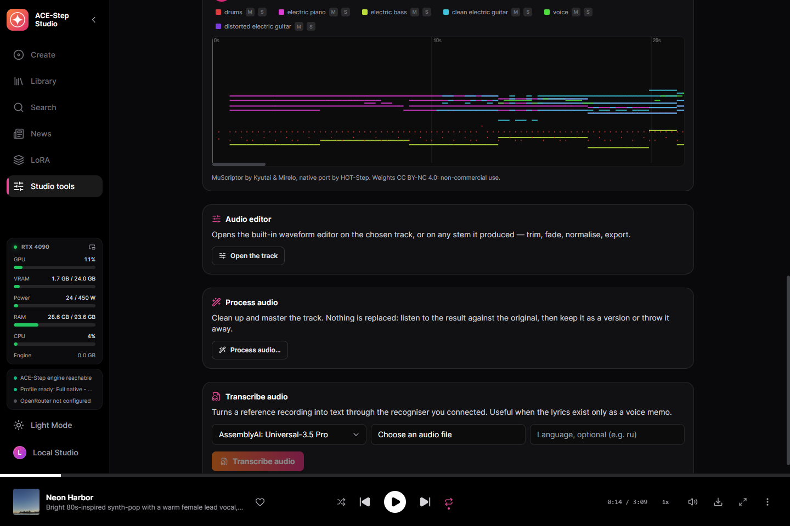
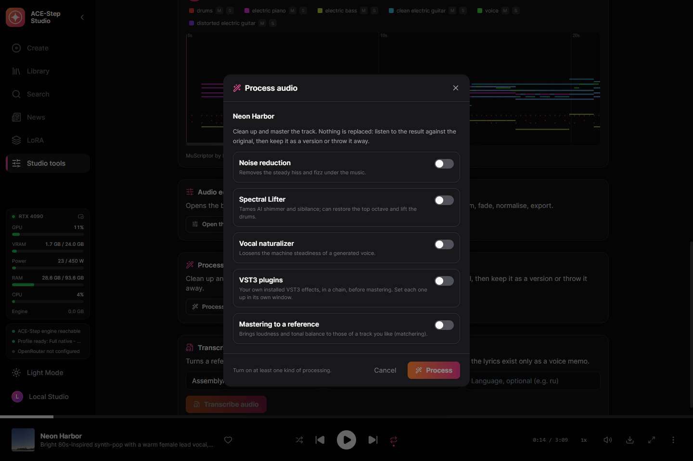
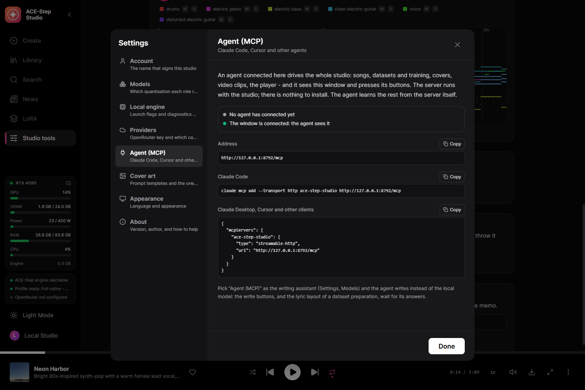
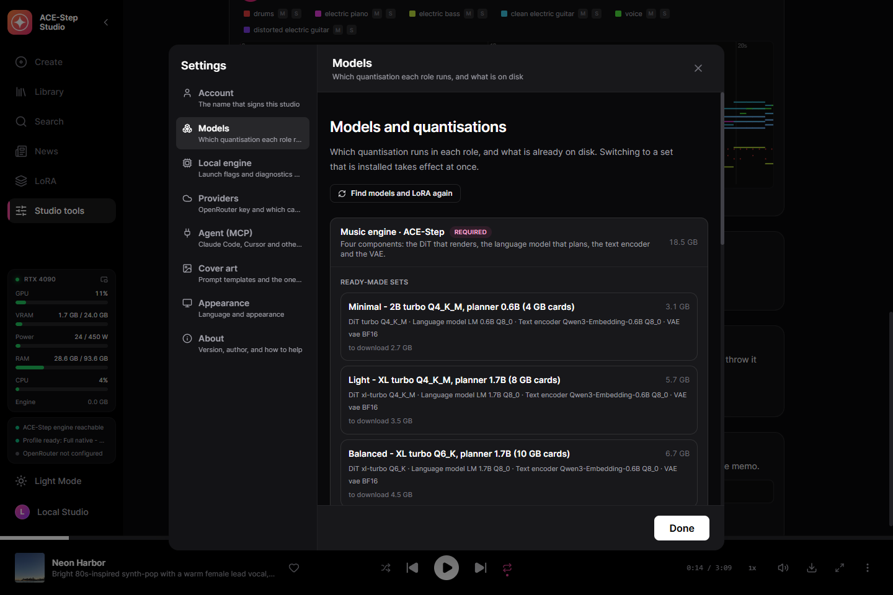
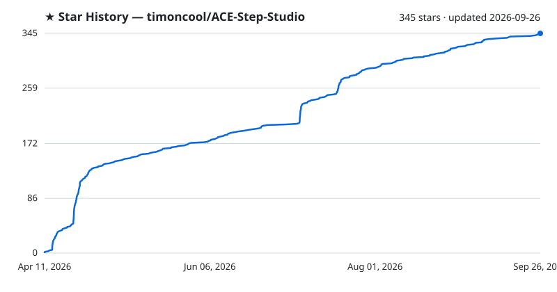

<div align="center">


# ACE-Step Studio

**Suno at home: full songs with vocals from ACE-Step 1.5 on your own GPU. One executable — no Python, no Node.js, no launcher.**

[](https://timoncool.github.io/ACE-Step-Studio/)
[](https://github.com/timoncool/ACE-Step-Studio/releases/latest)
[](DONATE.md)

[](LICENSE)
[](https://github.com/timoncool/ACE-Step-Studio/stargazers)
[](https://github.com/timoncool/ACE-Step-Studio/commits/main)
[](https://github.com/timoncool/ACE-Step-Studio/releases)

**English** · [Русский](https://timoncool.github.io/ACE-Step-Studio/ru.html) · [中文](https://timoncool.github.io/ACE-Step-Studio/zh.html) · [日本語](https://timoncool.github.io/ACE-Step-Studio/ja.html) · [한국어](https://timoncool.github.io/ACE-Step-Studio/ko.html)


</div>

ACE-Step Studio is a desktop studio for **ACE-Step 1.5**, the open music model that writes and
sings full songs. Describe a sound and write lyrics — or give it a one-line idea — and it plans
the song with its language model and renders it with vocals on your own graphics card. Covers,
remixes, repaints, a LoRA catalogue, your own LoRA trained on your songs, stems, MIDI, karaoke
and video clips, all in one window. Windows installer with auto-update or a portable folder, runs
offline on NVIDIA cards from 4 GB of VRAM.

It is built on [acestep.cpp](https://github.com/ServeurpersoCom/acestep.cpp), the native C++/GGML
port of ACE-Step 1.5. The studio around it is Rust and React in a Tauri window — nothing in the
runtime path is Python.

## What changed in 2.0

ACE-Step Studio 1.x was a folder of Python and Node.js: `install.bat` set up Python 3.12,
PyTorch and Node.js 22 — 7.6 GB of runtime before a single model — and `run.bat` started a
Gradio backend and an Express server behind a browser tab. 2.0 is a different program on a
different stack:

| | 1.x | 2.0 |
|---|---|---|
| Engine | the Python ACE-Step pipeline on PyTorch | [acestep.cpp](https://github.com/ServeurpersoCom/acestep.cpp), C++ on GGML: CUDA, Vulkan or the processor |
| Studio | Express + React in a browser tab, Gradio behind it | one executable: Rust service and React UI in a Tauri window |
| Install | `install.bat` → portable Python, PyTorch, Node.js | an installer that updates itself, or a portable folder |
| Models | safetensors, XL turbo 7.5 GB in BF16 or 18.8 GB | GGUF quantisations, a whole set from 3.1 GB (Q4) to 18.5 GB (BF16) |
| Smallest card | 12 GB of VRAM | 4 GB of VRAM |
| Model choice | 3 XL models | every DiT of ACE-Step 1.5 — 2B and XL, turbo, SFT, base, merges, community fine-tunes — in Q4 to BF16, switched above the create form |
| Writing | the ACE-Step language model, or OpenRouter | ACE-Step's planner, a local Gemma, OpenRouter, or your own agent over MCP — one writer at a time |
| LoRA | a file loaded at generation | a curated catalogue, Hugging Face search that reads each file before downloading it, and training your own on the card |
| Agents | — | an MCP server with 164 tools: an agent does everything the studio does |

How fast, measured on the installed 2.0 on an RTX 4090 with the BF16 set (XL turbo DiT, 4B
planner), from the request to an MP3 in the library, loading included — the times of the
samples below:

| Song | Length | Time |
|---|---|---|
| Vocals, the planner writes the song's codes first | 2:50–3:10 | 33–36 s |
| Instrumental, planned the same way | 2:30 | 30 s |
| Cover of a 3:10 song | 3:10 | 21 s |
| With a LoRA, rendered from the caption and lyrics alone | 2:40 | 21 s |

Not carried over from 1.x: flow-edit and the "Most Natural" repaint mode, which live in the
Python pipeline and not in acestep.cpp; the model tools (BF16 converter, model merger, LoRA
baking); free Pollinations covers — covers now come from an image model on OpenRouter; and
macOS and Linux — 2.0 is a Windows build, while acestep.cpp itself also runs on Linux and macOS.
1.x stays available on its [release page](https://github.com/timoncool/ACE-Step-Studio/releases/tag/v1.0.0)
and in the [Pinokio launcher](https://github.com/timoncool/ACE-Step-Studio-pinokio).

## For AI agents

Given this repository, an agent can set everything up and drive the studio by itself:

1. Install the studio from the [latest release](https://github.com/timoncool/ACE-Step-Studio/releases/latest) and start it.
2. Connect to its MCP server at `http://127.0.0.1:8792/mcp`:
   `claude mcp add --transport http ace-step-studio http://127.0.0.1:8792/mcp`
3. Read the skill it serves (resource `studio://skill`, prompt `studio`), the same text as
   [docs/mcp-skill.md](docs/mcp-skill.md), and start with the tool `studio_status`.

[llms.txt](llms.txt) says the same for tools that look for it. To keep the skill in Claude
Code, save [docs/mcp-skill.md](docs/mcp-skill.md) as `~/.claude/skills/ace-step-studio/SKILL.md`.

## What you can do

- **Full songs from a caption and lyrics** — up to ten minutes, in the languages ACE-Step
  sings. The planner (ACE-Step's own language model) fills in what you leave out — tempo,
  key, length, even the lyrics — and plans the song's structure before the DiT renders it.
- **A song from one line** — the simple form: an idea in, a finished song out. The writing
  assistant or ACE-Step's planner writes the caption and lyrics, never both at once.
- **Every ACE-Step 1.5 model** — the standard 2B and the XL DiT, turbo (8 steps), SFT and
  base (50), shift and continuous variants, merges and community fine-tunes, in Q4 to BF16
  and MXFP4; planners of 0.6B, 1.7B and 4B. The DiT is switched above the create form; a
  missing one downloads and takes over when it is there.
- **Covers, remixes and repaints** — take a track from your library and render it in a new
  style (with how closely it follows), remix it, repaint a stretch of it, or, with a base
  model, extract one stem, add stems or complete a track. A reference track lends its timbre.
- **Exact replay** — every track keeps its request and its audio codes, so it can be
  re-rendered bit for bit, or with other steps, a new seed, several takes, or another format.
- **200 ready examples** — ACE-Step's own example requests, one click to load.
- **Every engine setting** — steps, guidance and its eight modes, shift, solver and
  scheduler, the planner's temperature, CFG, top-p and top-k, both seeds, the plan strength
  (how many DiT steps follow the planner's audio codes), MP3, FLAC or 16/24/32-bit WAV.
- **A writing assistant** — a local Gemma model, OpenRouter, or your connected agent writes
  the caption and lyrics from an idea by ACE-Step's official songwriting rules. Lyrics you
  wrote yourself get their section tags with one button, the words exactly as you wrote them.
- **LoRA** — a catalogue of 131 LoRA picked from Hugging Face by likes and downloads, each
  described in five languages and credited to its author, and a search of everything Hugging
  Face has for ACE-Step, most liked first. Before a file downloads the studio reads its header
  and says which model size it fits (2B or XL) or why the engine cannot use it. A LoRA of the
  sound turns the planner's audio codes off, as ACE-Step's authors advise.
- **Train your own LoRA** — songs of one artist or style become a LoRA on your own card
  with HOT-Step's trainer and its recipe (LoKR, Prodigy, a stop at a target loss that keeps
  the best adapter). Every setting of the recipe is editable, and each checkpoint goes into
  the LoRA library in one click.
  - **A three-step wizard** — drop a folder of songs, check them, train. Albums with a cue
    sheet are cut into songs; titles and artists come from the tags, the file name and the
    folders.
  - **Preparation on its own** — lyrics come from the lyric databases players use (LRCLIB,
    QQ Music, Kugou), word for word; only a song none of them knows has its vocals separated
    and is heard by Whisper. MOSS-Music listens to every song and describes it, with the
    tempo and key measured.
  - **Train further** — not there yet? Set more epochs and the run goes on from the adapter
    it left, with the same recipe, songs and model.
- **Word-level karaoke** — enhanced LRC with a timestamp on every word, aligned by Parakeet
  or Whisper. Your lyrics are kept; only the timing is borrowed.
- **Six stems on the GPU** — drums, bass, other, vocals, guitar and piano with HT-Demucs.
- **Any track to MIDI** — a song, a stem or a processed take becomes multi-instrument MIDI
  with MuScriptor on the GPU, through HOT-Step's native port. A piano roll fills in while it
  listens; play it against the original, mute or solo an instrument, save the .mid.
- **Audio processing** — noise reduction, the Spectral Lifter, a vocal naturaliser, your own
  VST3 plugins in a chain, and mastering to a reference track. Compare before and after while
  it plays, then keep the result as a version of the track or throw it away.
- **Video clips** — a visualiser editor with presets, effects, text layers and karaoke
  lyrics, rendered to MP4 with the bundled ffmpeg.
- **Driven by your agent (MCP)** — Claude Code, Claude Desktop or Cursor do everything the
  studio does, and see and work its window.
- **A library of plain files** — search, playlists, versions, cover art from prompt
  templates, MP3s with title, lyrics and cover in their tags. Interface in English, Russian,
  Chinese, Japanese and Korean.

## Screenshots

| | |
|---|---|
|  |  |
| The simple form — one line in, a whole song planned and rendered | A finished track with its lyrics, ready to replay, cover or repaint |
|  |  |
| The model switcher — every DiT of ACE-Step 1.5 in Q4 to BF16 and MXFP4, what is on disk | The LoRA catalogue — 131 LoRA, each credited to its author and marked 2B or XL |
|  |  |
| Hugging Face search — every file checked for the model size it fits before it downloads | A dataset — songs from the library with their lyrics and captions |
|  |  |
| Your own LoKR trained on the card — the loss as it learns, the best epoch into the library | Any track to MIDI — a piano roll of every instrument, played against the original |
|  |  |
| Audio processing — noise reduction, the Spectral Lifter, VST3, mastering to a reference | An agent over MCP — the address and the lines to paste into Claude Code or any client |
|  | |
| Settings — ready-made sets and one quantisation per role, and finding files again | |

The same screens in the language you read: [Русский](https://timoncool.github.io/ACE-Step-Studio/ru.html),
[中文](https://timoncool.github.io/ACE-Step-Studio/zh.html), [日本語](https://timoncool.github.io/ACE-Step-Studio/ja.html),
[한국어](https://timoncool.github.io/ACE-Step-Studio/ko.html) — on the project page, or in
[docs/screenshots](docs/screenshots).

## Samples

Made in the released build on an RTX 4090 with the BF16 set, nothing edited afterwards.
Listen in the browser on the [project page](https://timoncool.github.io/ACE-Step-Studio/#samples)
or download the MP3s from [docs/samples](docs/samples).

| Song | How it was made | Style |
|---|---|---|
| [Neon Harbor](docs/samples/neon-harbor.mp3) | English synth-pop from a caption and lyrics | 80s synth-pop, warm female vocal, analog arpeggios, gated reverb snare, 118 BPM |
| [Дорога домой](docs/samples/doroga-domoy.mp3) | Russian folk rock with accordion | Russian folk rock, raspy male vocal, accordion hooks, galloping bass, 142 BPM |
| [夜の電車](docs/samples/yoru-no-densha.mp3) | Japanese city pop | city pop, airy female vocal, electric piano, slap bass, brass stabs, 104 BPM |
| [Fuego lento](docs/samples/fuego-lento.mp3) | Latin pop in Spanish | latin pop, warm male vocal, nylon guitar, congas, piano montuno, 96 BPM |
| [Midnight Drive](docs/samples/midnight-drive.mp3) | An instrumental | instrumental synthwave, analog bass arpeggios, gated drums, lush pads, 100 BPM |
| [Classic lo-fi hip-hop instrumental](docs/samples/one-line.mp3) | One line in the simple form; ACE-Step's planner wrote the caption, tempo and key | one line: a warm lo-fi beat for a rainy night drive, dusty drums and mellow electric piano |
| [Neon harbor, call my name](docs/samples/neon-harbor-cover.mp3) | Cover of the first song as an acoustic ballad | acoustic ballad, breathy female vocal, fingerpicked guitar, gentle piano |
| [Night Rider](docs/samples/night-rider-lora.mp3) | With the Synthwave XL LoRA from the catalogue | roti-s1nthwv, driving synthwave, powerful male vocal, pulsing analog bass, 118 BPM |

## What it needs

- Windows 10/11 x64.
- A GPU with **4 GB of VRAM** or more for the smallest set; the studio recommends the set your card runs best:
  - **NVIDIA**, from the GTX 900 series on, runs on CUDA — the fastest path. The studio
    ships two CUDA builds of the engine and picks the one your card and driver run:
    CUDA 13 for Turing and newer (GTX 16, RTX 20–50) with driver 580 or newer, CUDA 12 for
    Maxwell, Pascal and Volta and for any card on a driver from 525 to 579.
  - **AMD or Intel — untested.** The engine carries a Vulkan backend for them; reports from
    owners are welcome.
  - Without a GPU the engine falls back to the processor, which works but is many times
    slower.
- 3.1–18.5 GB of disk for one model set.
- Training a LoRA (optional): an NVIDIA RTX 30-series card or newer (it trains in BF16). A LoKR
  on the XL DiT took 19.4 GB of the RTX 4090's 24 GB here, 20 epochs on five songs in 67 s;
  HOT-Step, whose trainer the studio runs, trains the XL on cards with 12 GB. The unquantised DiT it
  trains on (4.5 GB for the 2B, 9.3 GB for the XL) and the trainer (0.1 GB) download only when
  you train. Describing songs by ear needs about 12 GB of VRAM and 9.8 GB more disk for
  MOSS-Music; without it the captions are written by hand.

## Quick start

1. **Install** — run `ACE-Step.Studio_x.y.z_x64-setup.exe` from the
   [latest release](https://github.com/timoncool/ACE-Step-Studio/releases/latest), or unzip the
   portable archive anywhere and run `ACE-Step-Studio.exe`.
2. **Choose a model set** — the first screen preselects the set your card can run. Press
   download; it fetches only what is missing and resumes if interrupted.
3. **Create** — describe the sound and write lyrics, load one of the examples, or type one
   line in the simple form, and press Create. The engine starts by itself and the song lands
   in your library.

Everything the studio owns stays in its own folder: models, songs, settings, logs,
temporary files and the WebView2 profile, beside `ACE-Step-Studio.exe`. That holds for the
portable archive and for an installation into any folder the studio can write to; deleting
the folder removes the studio. Only an installation into a read-only location such as
Program Files falls back to `%LOCALAPPDATA%\ACE-Step Studio`. The installed version updates
itself: a new release is offered inside the studio and installed in place.

## Drive it from an agent (MCP)

While the studio is open it serves MCP at `http://127.0.0.1:8792/mcp`: an agent such as
Claude Code, Claude Desktop or Cursor does everything the page does, through the same code —
songs, covers and repaints, ACE-Step's planner, the library, stems, MIDI, karaoke,
processing, video clips, the player, LoRA from the catalogue or Hugging Face, and a LoRA
from a folder of songs end to end — and sees and works the window itself: a screenshot, its
controls, clicks and typing. 164 tools, grouped by area. ACE-Step's writing rules and
official examples come with the server, so the agent writes the captions and lyrics itself.

With **Agent (MCP)** chosen as the writing assistant (Settings, Models), the connected agent
also answers the studio's own write buttons, the simple form and dataset preparation.
Settings, **Agent (MCP)** shows whether an agent is connected and what to paste.

```bash
claude mcp add --transport http ace-step-studio http://127.0.0.1:8792/mcp
```

[docs/mcp-skill.md](docs/mcp-skill.md) is the skill an agent reads: every tool, what the
model expects, and step-by-step recipes.

## Models

A runnable ACE-Step installation is four files: the **DiT** (renders the sound), the
**planner** (the 5 Hz language model that writes and plans), the **text encoder** and the
**VAE**.

| Your GPU | Set | Download |
| --- | --- | --- |
| 24 GB VRAM | Full native — XL turbo BF16, planner 4B BF16 | 18.5 GB |
| 13 GB and above | Quality — XL turbo Q8_0, planner 4B Q8_0 | 10.1 GB |
| 10 GB and above | Balanced — XL turbo Q6_K, planner 1.7B | 6.7 GB |
| 8 GB and above | Light — XL turbo Q4_K_M, planner 1.7B | 5.7 GB |
| 4 GB and above | Minimal — 2B turbo Q4_K_M, planner 0.6B | 3.1 GB |

The studio detects your card and preselects the set, but the download is always your
decision. Any other DiT — SFT, base, the shift and continuous turbos, the XL merges, MXFP4,
and mdmachine's community Regrind fine-tune with its retrained VAE decoders — is one click in
the switcher above the create form or in Settings, Models, which also builds a custom mix
role by role.

The files come from [Serveurperso/ACE-Step-1.5-GGUF](https://huggingface.co/Serveurperso/ACE-Step-1.5-GGUF)
(pinned to `666ac70`), [scragnog's merges](https://huggingface.co/scragnog/ace-step-1.5-gguf-merge-models),
[MXFP4 quants](https://huggingface.co/scragnog/Ace-Step-1.5-MXFP4-Quants) and
[ScragVAE](https://huggingface.co/scragnog/Ace-Step-1.5-ScragVAE), and
[mdmachine/ACEStep-XL-Regrind-V1](https://huggingface.co/mdmachine/ACEStep-XL-Regrind-V1), each
pinned to a revision and checked by size and SHA-256. They are written to, and can be dropped
into by hand at:

- `<the studio's folder>\data\models\acestep-cpp\` — the portable folder, or the folder
  you installed into
- `%LOCALAPPDATA%\ACE-Step Studio\models\acestep-cpp\` — only for an installation into a
  read-only location

A file placed by hand with the exact catalogue name is recognised and never downloaded again;
**Find models and LoRA again** (Settings, Models, or the LoRA page) makes the running engine
see files put there while it runs. Downloads made by the studio are found on their own.

## The engine and the DLLs it needs

```text
ace-server.exe → ggml.dll, ggml-base.dll            shipped inside the app
  loads at run time, whichever the machine can use:
  ├─ ggml-cuda.dll     → cublas64_13.dll, cublasLt64_13.dll (downloaded once), nvcuda.dll (NVIDIA driver)
  ├─ ggml-vulkan.dll   → vulkan-1.dll (every AMD, Intel and NVIDIA driver)
  └─ ggml-cpu-*.dll    builds from SSE4.2 to AVX-512; the best one for the processor is picked
  + msvcp140, vcruntime140, vcruntime140_1, vcomp140   Visual C++ runtime, shipped app-local
```

**Shipped inside the app.** `ace-server.exe`, every `ggml*.dll`, built from the pinned
acestep.cpp commit (`engines/engine-source.json`) with all backends, and the Visual C++
runtime it needs live in `resources\engine\` beside the main executable. Nothing is
installed into Windows.

**Downloaded once, on the first engine start — on NVIDIA only.**

| File(s) | Where from | Size | Why |
| --- | --- | --- | --- |
| `cublas64_13.dll`, `cublasLt64_13.dll` | NVIDIA's redistributable [`libcublas-windows-x86_64-13.5.1.27-archive.zip`](https://developer.download.nvidia.com/compute/cuda/redist/libcublas/windows-x86_64/libcublas-windows-x86_64-13.5.1.27-archive.zip) | 391 MB (zip) | The CUDA linear algebra `ggml-cuda.dll` is linked against; too large, and under NVIDIA's licence, to bundle. |
| `cublas64_12.dll`, `cublasLt64_12.dll` | [`libcublas-windows-x86_64-12.9.1.4-archive.zip`](https://developer.download.nvidia.com/compute/cuda/redist/libcublas/windows-x86_64/libcublas-windows-x86_64-12.9.1.4-archive.zip) | 550 MB (zip) | Only for the CUDA 12 build: older cards and drivers. |

A machine with the CUDA toolkit already has cuBLAS on its `PATH` and downloads nothing.

## Architecture

```text
React UI ─┐
          ├─ ACE-Step-Studio.exe   (Tauri window + Rust/Axum service on 127.0.0.1:8792)
Rust axum ┘        │
                   ├─ acestep.cpp `ace-server`   (C++/GGML, GGUF, 127.0.0.1:8089)
                   ├─ music-train.exe            (HOT-Step ace-train, LoRA training, optional)
                   └─ vst-host.exe               (HOT-Step VST3 host, a process of its own)
```

The service is compiled into the desktop binary. It supervises the engine process, restarts
it when you switch models, and imports finished songs itself, so a result is never lost if
the window was reloaded or closed mid-generation. Progress is read from the engine: the
planner's tokens, the DiT's steps, decoding.

## Building from source

```powershell
npm --prefix app install
npm --prefix desktop install
cargo test --workspace
npm --prefix app test
```

Developing the UI against a running service:

```powershell
cargo run -p music-server           # service on 127.0.0.1:8792
npm --prefix app run dev            # UI on 127.0.0.1:3000
```

The engine: `scripts/build-engine-runtime.ps1 -RuntimeBackend cuda -CudaArchitecture universal`
builds the pinned acestep.cpp commit with runtime-loaded CUDA 13 and CUDA 12, Vulkan and CPU
backends, using the CUDA toolkits, the Vulkan SDK, MSVC and Ninja.
`scripts/build-release.ps1 -Version X.Y.Z` produces the NSIS installer, the portable archive
and the signed `latest.json` for the updater; it reads the signing key from
`TAURI_SIGNING_PRIVATE_KEY` or `%USERPROFILE%\.tauri\ace-step-studio.key`. Model weights are
never part of a release.

## Other Projects by [@timoncool](https://github.com/timoncool)

| Project | Description |
|---------|-------------|
| [YuE2 Studio](https://github.com/timoncool/YuE2-Studio) | The same studio on YuE2 — songs with an editable score |
| [MiniMax Music3 Studio](https://github.com/timoncool/MiniMax-Music3-Studio) | The same studio on MiniMax Music 3 |
| [Foundation Music Lab](https://github.com/timoncool/Foundation-Music-Lab) | Music generation + timeline editor |
| [VibeVoice ASR](https://github.com/timoncool/VibeVoice_ASR_portable_ru) | Portable speech recognition |
| [Qwen3-TTS](https://github.com/timoncool/Qwen3-TTS_portable_rus) | Portable text-to-speech with voice cloning |
| [telegram-api-mcp](https://github.com/timoncool/telegram-api-mcp) | Full Telegram Bot API as an MCP server |

## Authors

- **Nerual Dreming** — [Telegram](https://t.me/nerual_dreming) | [neuro-cartel.com](https://neuro-cartel.com) | [ArtGeneration.me](https://artgeneration.me)
- **Нейро-Софт** — [Telegram](https://t.me/neuroport) | portable neural networks

## Acknowledgements

- The [ACE-Step team](https://github.com/ace-step) for ACE-Step 1.5, its models and its songwriting guide.
- [Serveurperso](https://github.com/ServeurpersoCom) for acestep.cpp and the GGUF conversions.
- [scragnog](https://github.com/scragnog) for [HOT-Step-CPP](https://github.com/scragnog/HOT-Step-CPP): the LoRA trainer and its recipe, the captioner, the MIDI transcription port, the VST3 host, the merges, MXFP4 quants and ScragVAE, and the noise reduction, Spectral Lifter and mastering designs the studio's audio processing is ported from.
- [mdmachine](https://huggingface.co/mdmachine) for the Regrind XL fine-tune and its VAE decoders.
- [sergree](https://github.com/sergree) for [matchering](https://github.com/sergree/matchering), and [jeankassio](https://github.com/jeankassio) for the vocal naturalizer in [ComfyUI_MusicTools](https://github.com/jeankassio/ComfyUI_MusicTools).
- The authors of the LoRA in the catalogue, each credited and linked on its card.
- [fspecii](https://github.com/fspecii/ace-step-ui) for the ACE-Step UI that 1.x grew from.
- The [LAME](https://lame.sourceforge.io) project for the MP3 encoder.

## Support the Author

I build open-source software and do AI research. Most of what I create is free and available to everyone. Your donations help me keep creating without worrying about where the next meal comes from =)

**[All donation methods](DONATE.md)** · [Русский](DONATE.ru.md) · [中文](DONATE.zh.md) · [日本語](DONATE.ja.md) · [한국어](DONATE.ko.md) | **[dalink.to/nerual_dreming](https://dalink.to/nerual_dreming)** | **[boosty.to/neuro_art](https://boosty.to/neuro_art)**

- **BTC:** `1E7dHL22RpyhJGVpcvKdbyZgksSYkYeEBC`
- **ETH (ERC20):** `0xb5db65adf478983186d4897ba92fe2c25c594a0c`
- **USDT (TRC20):** `TQST9Lp2TjK6FiVkn4fwfGUee7NmkxEE7C`

## Star History

<a href="https://github.com/timoncool/ACE-Step-Studio/stargazers">
 <picture>
   <source media="(prefers-color-scheme: dark)" srcset="docs/stars-dark.svg" />
   <source media="(prefers-color-scheme: light)" srcset="docs/stars-light.svg" />
   
 </picture>
</a>

## License

The studio is MIT, and so are acestep.cpp and ACE-Step 1.5 with its models. mdmachine's
Regrind fine-tune and its VAE decoders are CC BY-NC-SA 4.0 — songs made with them are for
non-commercial use. The LoRA in the catalogue carry their authors' licences, shown on each
card's page. MuScriptor's weights, used for MIDI, are CC BY-NC 4.0.

What changed and when is in [CHANGELOG.md](CHANGELOG.md).
